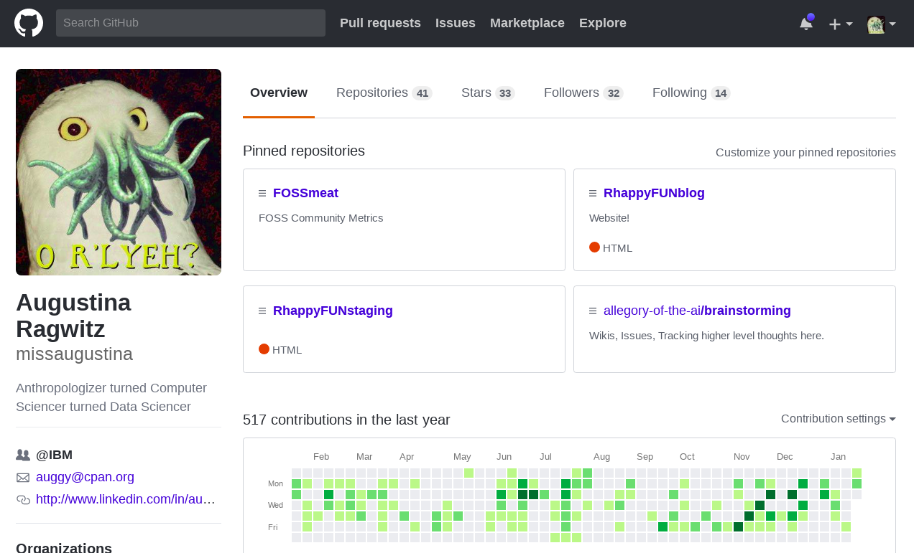
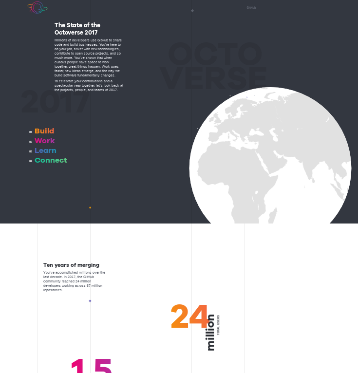
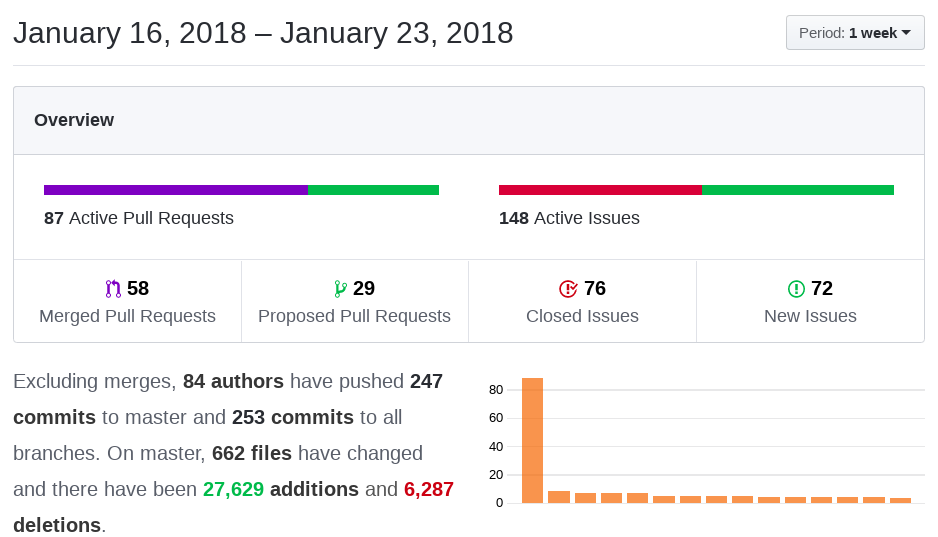

```{r includes, include=FALSE}
library(dplyr)
library(ggplot2)
library(ggthemes)
library(scales)
library(visNetwork)
```

## What is the value of open source engagement?

Evaluating the effectiveness of open source engagement, whether you are releasing your own code or contributing to other peoples' projects, is a fairly ambiguous undertaking.

Traditional methods of evaluation of "engagement success" are tied to easily quantifiable events. In sports, athletes are evaluated by game play rules and physical performance such as how fast, how high, and how many. In sales, you might be measured on customer conversions and monetary sales figures.

Open Source community evaluation is less tied to tangible artifacts and outcomes. "Success" in open source communities involves three key areas:

 * Individual Influence (how much am I doing?)
 * Organization Influence (how important are we to the community?)
 * Popularity (does anyone care about what we are doing?)

This is very similar to Research & Development. In R&D, one might evaluate Individual Influence through publications, Organizational Influence through patents and sales of developed products (indirect sales), and Popularity through citations and market share.

This article will specifically focus on Organizational Influence and proposes using commits as a heuristic to gauge an organization's engagement level with an open source project. To clarify, while revenue is a driving factor in our economy and for many businesses, the focus of this article is not on revenue. We are focusing on values; revenue is an outcome.

## How do we measure the value of open source engagement?

The current paradigm for open source community metrics is heavily influenced by the limited context of the individuals involved in those communities. Specifically, people with a narrow background in computer science and IT have little training in social science and assume system metrics are sufficient for measuring humans. In systems, precision is important for identifying performance bottlenecks, uptime service agreements, and capacity planning.

Traditionally the Tech industry has applied this context to human metrics (dubbed here the "Human-System Metric Paradigm"), based on the assumption that the value of workers is the volume of the work they produce. Therefore, metrics must measure the volume of work such as lines of code or number of tickets closed with a very high degree of precision. In addition, worker compensation and rank are directly tied to this reported volume of work.

Quantatitive volume-of-work metrics don't really tell us anything about the value or nature of the work. They can also result in behavior modification when the competitive sales paradigm is applied and the volume measured is tied to tangible rewards.

> Have you ever modified your work activity to "pad" a volume-of-work metric?

Humans cannot be measured by Human-System Metrics because humans are too ambiguous. Our metrics should be question-driven, based on our goals and values and how we want to achieve them, rather than purely data-driven. In fact, no data collection should be embarked upon without proper introspection and reflection on how the metrics inform our larger goals (and if they are still relevant).

> How do we break out of the Human-System Metrics Paradigm?
> 
> 1.  Ask better questions about open source engagement
> 1.  Seek meaningful answers that drive strategic discussions (not just dashboards)

## Github: A Social Network Platform for Code




Many open source communities and organizations host their projects through Github (not to be confused with git, the command line tool that Github provides an interface to). Github is a treasure trove of public activity just waiting to be analyzed, yet Github themselves fail to offer anything insightful in this area! Every year Github releases the State of the Octoverse report which is a prime example of data-driven metrics. The report is chock-full of pretty plots and counts of things but is otherwise very disconnected and incoherent, failing to tell any kind of story or share anything deep or meaningful.




Every repository's page contains basic counts of things like commits and contributors. There's even an insights page for even more (but not particularly insightful) counts of things. One cannot formulate a meaningful sentence using these types of Human-System Metrics.





## Commits as a Measure of Influence

Commits are a historical record of attributed code changes. The current popular measure for "ranking" influence is by counting up the number of commits and assigning them to an author or a company based on identifying a set of authors.

> Common Question: Who has the most commits?
> Better Question: How significant is an organization's influence?

## Identifying Organization Affiliation

The most common method for company identification is either through the domain name of the email address the author used to commit or by the company field in the author's Github profile. The company field is free-form text, has no modification history, and is not really verifiable. In addition only a minority of Github users actually use it. 

A user committing to a repository using their work email address is the most reliable method of organization affiliation identification. However, accuracy across projects is still a challenge because authors don't always use the same email address and some never use their work email address.

```{r tf_email_domains, fig.cap="Tensorflow - Distribution of Email Domain Types"}

author_summary <- readRDS("data/tf_author_summary.Rds")
total_authors <- sum(author_summary$num_authors)

ggplot(author_summary %>% group_by(author_domain_type) %>% summarize(num_authors=sum(num_authors_type)),
       aes(x=reorder(author_domain_type, num_authors), y=round(num_authors/total_authors, 4))) +
  geom_bar(aes(fill=reorder(author_domain_type, num_authors)), stat="identity", show.legend = FALSE) +
  coord_flip() +
  theme_few() +
  scale_y_continuous(labels = percent, breaks=pretty_breaks()) +
  labs(x="Author Email Domain Type", y="Authors", title="Tensorflow - Total Authors by Email Domain Type")

```

```{r tf_email_domains_pct, fig.cap="Tensorflow - Percent of Authors per Email Domain"}

author_summary <- readRDS("data/tf_author_summary.Rds")

ggplot(author_summary %>% filter(round(pct_authors, 2) > 0), 
       aes(x=reorder(author_domain, pct_authors), y=pct_authors)) +
  geom_bar(aes(fill=author_domain_type), stat="identity") +
  coord_flip() +
  theme_few() +
  scale_y_continuous(labels = percent, breaks=pretty_breaks()) +
  labs(x="Author Email Domain", y="Authors", title="Tensorflow - Top Authors by Email Domain (%)") +
  guides(fill=guide_legend(title="Domain Type"))

```

```{r tf_authors_per_email, fig.cap="Tensorflow - Unique Authors per Email Domain - What does this tell us about how engaged organizations are?"}

author_summary <- readRDS("data/tf_author_summary.Rds")

ggplot(author_summary %>% 
         filter(author_domain_type %in% c("Other", "Edu")) %>% top_n(10, pct_authors), 
       aes(x=reorder(author_domain, pct_authors), y=pct_authors)) +
  geom_bar(aes(fill=author_domain_type), stat="identity") +
  coord_flip() +
  theme_few() +
  scale_y_continuous(labels = percent, breaks=pretty_breaks()) +
  labs(x="Author Email Domain", y="Authors", title="Tensorflow - Top Authors by Email Domain (%)") +
  guides(fill=guide_legend(title="Domain Type"))
```

The Human-System Metrics approach to this problem is to develop a complex solution for author affiliation identification in a quest for precision, but only small gains can be had for the large increases in complexity and overhead. A question-driven approach built on proven social science and statistical methods suggests that we do not need precision, as long as we're asking the right questions.

```{r email_network, eval=FALSE}

# Code to generate the interactive network

tf_google_email_nodes <- 
  readRDS("data/tf_google_email_nodes.Rds")
tf_google_email_edges <- 
  readRDS("data/tf_google_email_edges.Rds")

tf_google_graph <- visNetwork(tf_google_email_nodes, tf_google_email_edges) %>%
  visOptions(highlightNearest = TRUE, nodesIdSelection = TRUE)

tf_google_graph

```


[Interactive graph available here](2018/02/27/gh_emails_graph.html)

```{r tf_email_domains_network, fig.cap="Use of a Network to Disambiguate Authors and Committers (We identified more Googlers but that's about it)"}

author_summary_network <- readRDS("data/tf_author_summary_network.Rds")
ggplot(author_summary_network %>% filter(pct_authors > 0), 
       aes(x=reorder(author_domain, pct_authors), y=pct_authors)) +
  geom_bar(aes(fill=author_domain_type), stat="identity") +
  coord_flip() +
  theme_few() +
  scale_y_continuous(labels = percent, breaks=pretty_breaks()) +
  labs(x="Author Email Domain", y="Authors", title="Tensorflow - Top Email Domains (Network)") +
  guides(fill=guide_legend(title="Domain Type"))

```

We know that we can identify at least some affiliations with high certainty. Therefore, the heuristic we'll consider is that if an organization is actively engaged then they will have at least 1 commit with an associated email domain for a given time interval. This heuristic also prevents "gaming" by having members make a lot of erroneous commits to projects to pad their leaderboard position since only 1 will be counted for a given time interval.

```{r num_committers_month, fig.cap="Committers to Tensorflow by Email Domain - We already know these should be mostly Googlers and given the huge proportion of Personal email domains anything else must be significant."}

committers_month <- readRDS("data/committer_month_network.Rds")

ggplot(committers_month, 
       aes(x=commit_month, y=num_committers_type)) +
  geom_bar(aes(fill=committer_domain_type), position="dodge", stat="identity") +
  theme_few() +
  labs(x="Commit Month", y="Committers", title="Tensorflow - Committers per Month") +
  guides(fill=guide_legend(title="Domain Type"))

```

> Caveat: Could we fail to identify a highly engaged organization using this heuristic?

## Commit Patterns instead of Commit Counts

### Engagement Frequency (Commit Interval)

When we think about relationships with people, the people we have the strongest ties to are often the ones we've interacted with most regularly over a longer period of time. Using this model, instead of counting commits we can instead look at whether or not we have at least one commit consistently and for how long. This also shows us how long an organization has been committing to a project, something that just a count of commits can't tell us.

Specifically this metric measures the frequency of time intervals with at least one commit (eg, Months) and answers the question: How long has the organization been engaged? 

```{r engagement_freq_month, fig.cap="Organizations with more than 6 months of Tensorflow Commit Months with at least one identified affiliated author"}

author_commits_month <- 
  readRDS("data/tf_author_commits_month.Rds")

# number of time periods with commits
ggplot(author_commits_month %>% 
         filter(author_domain_type=="Other") %>%
         summarise(total_commit_months=first(total_commit_months)) %>%
         top_n(5, total_commit_months), 
       aes(x=reorder(author_domain, total_commit_months), y=total_commit_months)) + 
  geom_bar(stat="identity", aes(fill=author_domain), position="dodge", show.legend = FALSE) +
  labs(x="Organization (Top)", y="Months with Tensorflow Commit", title="Tensorflow - Month Engagement Frequency") +
  theme_few() +
  coord_flip() +
  scale_y_continuous(breaks=pretty_breaks())

```


```{r engagement_freq_qtr, fig.cap="Organizations having the most Tensorflow Commit Quarters with at least one affiliated author"}

author_commits_qtr <- 
  readRDS("data/tf_author_commits_qtr.Rds")

# number of time periods with commits
ggplot(author_commits_qtr %>%
         filter(author_domain_type == "Other") %>%
         summarise(total_commit_quarters=first(total_commit_quarters)) %>%
         top_n(5, total_commit_quarters), 
       aes(x=reorder(author_domain, total_commit_quarters), y=total_commit_quarters)) + 
  geom_bar(stat="identity", aes(fill=author_domain), show.legend = FALSE) +
  theme_few() +
  coord_flip() +
  labs(x="Organization (Top)", y="Quarters w/ Tensorflow Commit", title="Tensorflow - Quarter Engagement Frequency")

```

### Engagement Lifetime (Commit Interval Sequence)

When plotted as a time series, the Commit Intervals illustrated above can also show us how consistently the organization has been engaged.

```{r engagement_lifetime_month, fig.height=8, fig.width=10, fig.cap="Organizations having the most months with an affiliated commit"}
# has commits over time period
ggplot(author_commits_month %>% filter(total_commit_months > 7 & author_domain_type %in% c("Other", "Edu")), 
       aes(x=commit_month, y=has_commits)) + 
  geom_bar(stat="identity", aes(fill=reorder(author_domain, -total_commit_months))) +
  theme_few() +
  theme(axis.text.x=element_text(angle = 90, hjust = 1)) +
  guides(fill=guide_legend(title="Email Domains (Top)", ncol=1)) +
  labs(x="Month", y="Has Tensorflow Commit", title="Tensorflow - Month Engagement Lifetime")
  
```


```{r engagement_lifetime_qtr, fig.cap="Organizations having the most Quarters with an affiliated commit"}
# has commits over time period
ggplot(author_commits_qtr %>% filter(total_commit_quarters > 4 & author_domain_type %in% c("Other", "Edu")), 
       aes(x=commit_quarter, y=has_commits)) + 
  geom_bar(stat="identity", aes(fill=reorder(author_domain, -total_commit_quarters))) +
  theme_few() +
  theme(axis.text.x=element_text(angle = 90, hjust = 1)) +
  guides(fill=guide_legend(title="Company (Top)", ncol=1)) +
  labs(x="Quarter", y="Has Tensorflow Commit", title="Tensorflow - Quarter Engagement Lifetime")
  
```

## When is Counting Commits per Organization Sufficiently Accurate (and Low-Cost)?

In open source there are two basic types of governance - closed and open. Closed governance means that a project leadership is controlled by a single entity and committers will largely be affiliated with that entity. Depending on the goals of the controlling entity, a project may be converted into an Open governance project, which means any community member can take on a leadership role. In these cases, we can expect a higher rate of identification among committers belonging to the originating organization. 

When the identification is essentially X and ~X, then the proportion of committers and commits attributed to each group should indicate if the majority are associated with the originating organization.

### Committer Diversity

How well is a project doing at Open Governance? An open governance project, ideally, should not have a majority of committers representing one organization. This metric can also be used to demonstrate concerns on projects that have historically been open governance, especially if qualitatively there is a known majority influence.

The IBM Cognitive Open Technology team recently hosted [a Tensorflow panel at the conference Index](https://developer.ibm.com/opentech/2018/02/03/index-feb-20-ai-open-community-gathering-featuring-tensorflow/) that featured several key Tensorflow Googlers. The claim was made that Google was working to diversify the Tensorflow community by increasing non-Google committers.

```{r tf_committers_diversity, fig.height=10, fig.width=10, fig.cap="Unique Tensorflow Committers - This appears to support Google\'s claim"}
committer_diversity <- readRDS("data/tf_committer_diversity.Rds")

ggplot(committer_diversity, 
       aes(x=commit_month, y=pct_committers)) +
  geom_bar(aes(fill=committer_type), position="dodge", stat="identity") +
  theme_few() +
  labs(x="Committer", y="Commits", title="Tensorflow") +
  guides(fill=guide_legend(title="Google?")) +
  scale_y_continuous(labels = percent, breaks=pretty_breaks()) +
  facet_wrap(~ commit_year, scales="free")
```

```{r tf_commit_diversity, fig.height=10, fig.width=10, fig.cap="Tensorflow Commits by Committer Affiliation - What additional questions might this raise about Google's claim of committer diversity?"}
commit_diversity <- readRDS("data/tf_commit_diversity.Rds")

ggplot(commit_diversity, 
       aes(x=commit_month, y=pct_commits)) +
  geom_bar(aes(fill=committer_type), position="dodge", stat="identity") +
  theme_few() +
  labs(x="Committer", y="Commits", title="Tensorflow") +
  guides(fill=guide_legend(title="Google?")) +
  scale_y_continuous(labels = percent, breaks=pretty_breaks()) +
  facet_wrap(~ commit_year, scales="free")
```

## Conclusion

We've demonstrated how counts of commits and authors alone are not particularly insightful. However, when plotted over time we can gain more insight into the nature of the relationship organizations have with a project. Additionally, when considering what affiliations we can identify with more certainty, rather than chasing down what we can't, we can gauge if one or more organizations are dominating the activity in an open source project.

## Final Thoughts: The Caveats of Commits

Commits are not a sufficient single measure of engagement. Other activities must be considered to have an informed strategic discussion, not to mention the actual content of the commits themselves. Additionally the metrics proposed here are still in the exploration phase and have yet to be rigorously proven. Regardless, these metrics should offer a starting place to inspire better questions and better conversations about your own Open Source Engagement goals.

## Additional Resources
 * [Github](http://www.github.com) 
 * [State of the Octoverse Annual Report](https://octoverse.github.com/) 
 * [Identifying Tensorflow Authors + Committers by Email Address](https://rpubs.com/auggy/tensorflow-emails)
 * [Applying a Network to Tensorflow Commit Emails](https://rpubs.com/auggy/tensorflow-emails-igraph)
 * [Tensorflow Email Diversity](https://rpubs.com/auggy/tensorflow-emails-diversity)
 
 
 


