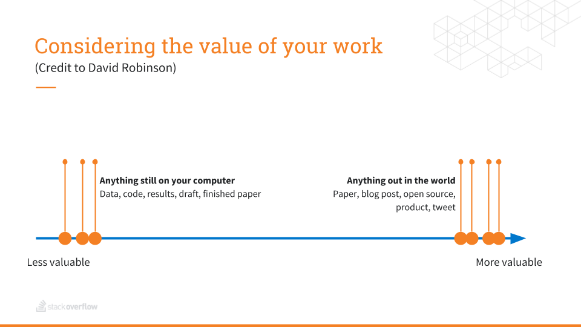

```{r knitr_init, echo=FALSE, cache=FALSE}
library(knitr)
library(rmdformats)

## Global options
options(max.print="75")
opts_chunk$set(echo=FALSE,
	             cache=FALSE,
               prompt=FALSE,
               tidy=TRUE,
               comment=NA,
               message=FALSE,
               warning=FALSE,
               fig.path = "img/")
opts_knit$set(width=75)
```

```{r render_me, eval=FALSE, include=FALSE}
library(here)
commandArgs <- function(...) params$slug
source(here::here("render_slug.R"))
```

```{r render_wp, eval=FALSE, include=FALSE}
library(here)
commandArgs <- function(...) c(params$slug,"http://developer.ibm.com/code/wp-content/uploads/sites/118/2018/05/")
source(here::here("render_wordpress.R"))
```


On Saturday, [R-Ladies Remote](https://twitter.com/rladiesremote) hosted its first virtual meetup! An entirely apropos inaugural presentation topic, [Julia Silge](https://juliasilge.com/) dropped the knowledge on Remote Work.

<blockquote class="twitter-tweet" data-lang="en"><p lang="en" dir="ltr">I enjoyed <a href="https://twitter.com/juliasilge?ref_src=twsrc%5Etfw">@juliasilge</a> &#39;s presentation. It wasn&#39;t even remotely boring. <a href="https://t.co/u5YED67r80">https://t.co/u5YED67r80</a></p>&mdash; Auggy (@mmmpork) <a href="https://twitter.com/mmmpork/status/992892984067686400?ref_src=twsrc%5Etfw">May 5, 2018</a></blockquote>
<script async src="https://platform.twitter.com/widgets.js" charset="utf-8"></script>

Her avid array of virtual viewers got to soak up her comprehensive insights on remote-work compatible company cultures and strategies for challenges remote workers often face. 

> "If one person in a meeting is remote, everyone is remote." Julia Silge

One nugget that really hit home for me was the value of work continuum. Daydreamers like myself have a million and one ideas knocking around in our noggins. While there is value in the creative process, [better an egg today than a hen tomorrow](https://twitter.com/hashtag/rchickenladies).



The value of work continuum can apply to pretty much every hare-brained idea we all have kicking around. The particular challenge remote workers face is lack of instant feedback one gets in an immersive office environment, making it a little easier to get lost in the weeds.

> What of what we do matters the most? 

Which leads us to a more "meta" topic that Julia brought up: how do remote workers connect to each other?

## The Social Connection

Bonding with your coworkers and a community is very challenging when your only interactions are scheduled work time meetings. While many solutions exist, like a virtual (insert-beverage-of-choice-here) chat or periodic in-person on-sites, connecting with the community beyond your workplace is another challenge.

> Why Go Remote?
>
> 1. Obvious - no group near you
> 1. Regular attendance not possible due to work or life demands or you may simply live too far away. 
> 1. Broaden your community network

The R-Ladies Remote chapter was officially announced in early 2018 in response to the number of R-Ladies that either didn't have access to a strong local community or were unable to make regular R-Ladies chapter meetings near them. I joined because it was an opportunity to connect with the many R-Ladies I meet from around the world!

![image: R-Ladies Remote [^1]](img/rladies-remote-why-remote.jpg)

## Remote R at IBM, the R Guild

At IBM, although many people traditionally work from an office, we are so geographically spread out we end up treating every meeting as a remote meeting. Additionally, R users are often buried in areas no one would expect (well, except for R users).

Last year, a colleague and I started a virtual community called the R Guild. We created an internal Slack channel where people could connect. We've also hosted meetings through [Zoom](http://www.zoom.us) and we are still experimenting with format and meeting rotation. People's schedules and timezones certainly complicate things, but for people who have been able to attend it's been worth it!

Going forward, we're exploring other options that support asynchronous interactions like a forum and periodic R code challenges. The group is still gaining momentum but it's been a great resource for connecting R users across the many-headed hydra known as IBM.

## Other Remote R Groups Worth Considering

If you don't fall into the "lady and/or non-binary" category but would like to join a remote community, I would recommend the [R4DS online learning community](https://www.jessemaegan.com/post/r4ds-the-next-iteration/) started by [Jesse Maegan](https://medium.com/@kierisi) in 2017. Jesse started the community as a way to connect with others who were learning R using the book [R for Data Science](http://r4ds.had.co.nz/).

> Follow the R4DS community on Twitter: https://twitter.com/R4DScommunity

## Starting Your Own Remote Community

The [R Consortium](https://www.r-consortium.org) provides support for useR groups and one day conferences called SatRdays. If your group is an R user group, [consider applying to the R Consortium for support](https://www.r-consortium.org/projects/r-user-group-support-program). This is especially handy for video conferencing that supports a large number of users.

If you're not sure about a regular group, consider a 1-day virtual conference! You can get additional support through the [R Consortium's SatRdays intiative](https://www.r-consortium.org).

Here are some additional things to think about when starting a Remote Community:

 * Time-zones - make sure event times include a link to a timezone converter
 * Offer multiple ways to connect - Not everyone has access to high bandwidth, can people call in on a land line? Is there a chat option?
 * Consider a chat-based meeting with an agenda - this approach has been used in other open source communities via IRC for a number of years
 * Make logs and meeting recordings for those who couldn't attend
 * Alternate meeting times to make attendance more convenient for different time-zones
 * Or better yet, recruit a co-organizer in an opposite timezone!

## Tools for Remote Meetings

The following is a short list of tools and services to consider for remote user groups. Any other remote meeting tools or tips you'd like to share? Tweet at me [\@mmmpork](https://twitter.com/intent/tweet?url=http://rhappy.fun/blog/remote-r&text=A+remote+meeting+thing+I+like+is+...+@mmmpork+@IBMCode+@RLadiesRemote&hashtags=rstats,rladies). Emojis and GIFs optional but appreciated.

### Chat Tools

 * [Slack](https://slack.com/) - Slack is one of the more popular chat platforms used these days. It can run in browser, on your phone, or locally through a client. It's a privately owned company and the free version has limited features.
 * [IRC](https://www.irccloud.com) - Internet Relay Chat is provided through Freenode or other providers. I've linked IRC Cloud because it's a great client that makes IRC as easy to use as Slack (and it works great on your phone!). It's free but may require some elbow grease and good ol' fashioned know-how to customize.

### Video Tools

Video is a great way to increase the quality of interaction with other members. The two general paradigms are one-way broadcasts (great for 1-day conference formats or traditional presentations) and video conferences.

#### One-Way Broadcasts

 * [Youtube Live](https://www.youtube.com/live_dashboard_splash) is a great, easy way to share a video feed and it offers a live chat stream.
 * [Twitch](https://www.twitch.tv/) is more well-known in the video game world, but IBM has had some success using it for live streaming. I was the guinea pig for a [video series](https://www.twitch.tv/ibmcode) our Open Source Advocacy folks are developing. [^2]

#### Video Conferencing

 * [Zoom](https://zoom.us/) - Zoom is used by a lot of folks in a lot of places, but it does cost money for a bigger audience. The [R Consortium](https://www.r-consortium.org) may be able to offer support through the [useR intiative](https://www.r-consortium.org/projects/r-user-group-support-program).
 * [Appear.in](https://appear.in/) - Runs in browser and supports up to 12 participants on the pro plan. A great option if your group is small.

## The Importance of IRL

I'm a huge fan of remote, especially as a researcher. However, it's still important to connect to communities in the flesh. If there aren't enough users of a particular language or technology in your area, find a more general topic or format people may be open to gathering on. For instance, my buddy [John Anderson aka Genehack](http://genehack.net), longing for the physical company of other Perl users, formed a general purpose "interpreted languages" user group in Salem, OR. 

If the reason you don't attend meetings is due to schedule issues, consider hosting a get-together at a time that works better for you. These don't have to be formal presentation style! 

Other options to consider: 

 * Code + Coffee (and/or other beverage of choice)
 * Form a Study Group
 * Book (or other media) Club
 * Regular Share and Tell around a common subject or problem
 * A Quarterly Hackathon or Code-A-Long

## Final Thoughts

Remote work is very rewarding and satisfying, however we do need to get out of the house and put on pants once in awhile. For those times when putting on pants is less practical, remote communities can serve as a great substitute for expanding our personal networks and stoking our social fires.

[^1]: [R-Ladies Remote "Why R-Ladies Remote?"](https://twitter.com/RLadiesRemote/status/988580783261564928)
[^2]: The video seems to have disappeared! I'll update once I find out where they archived it!
